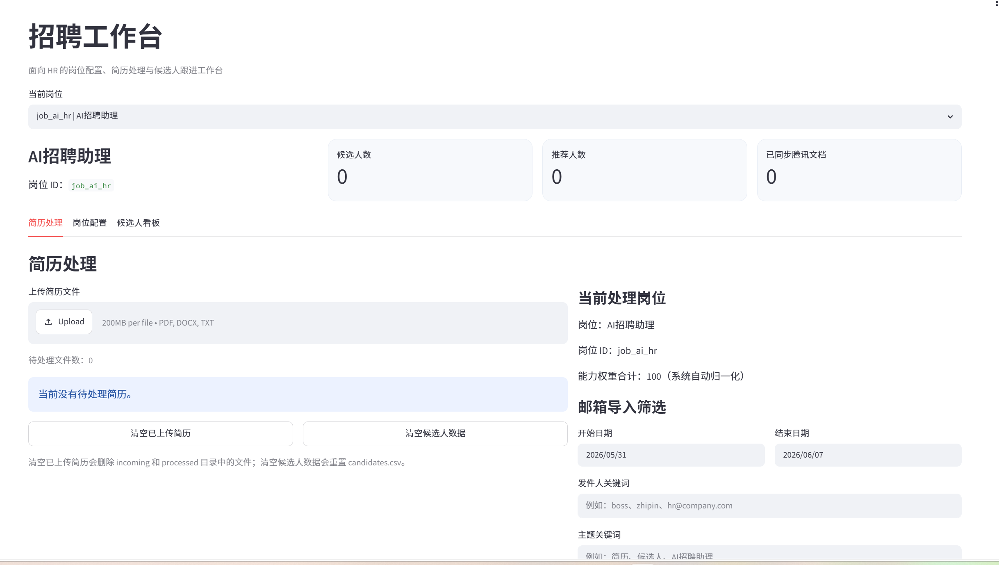
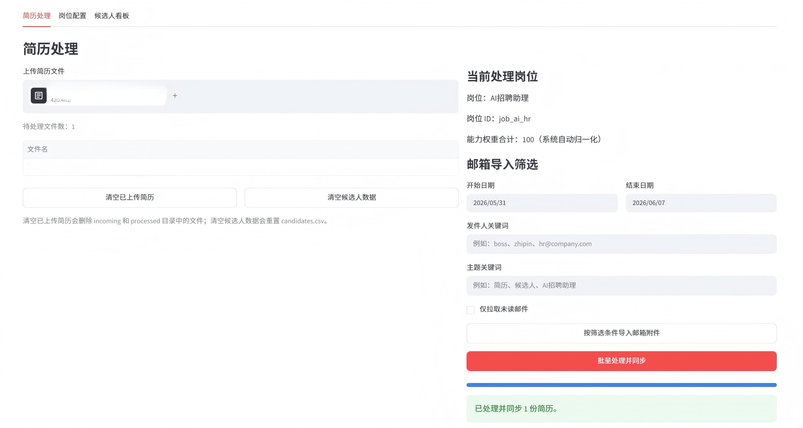
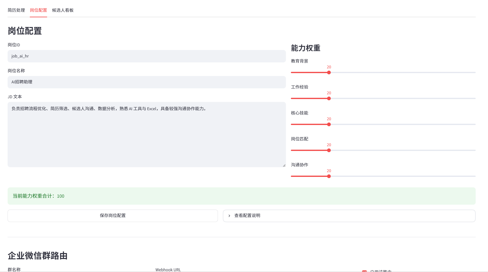
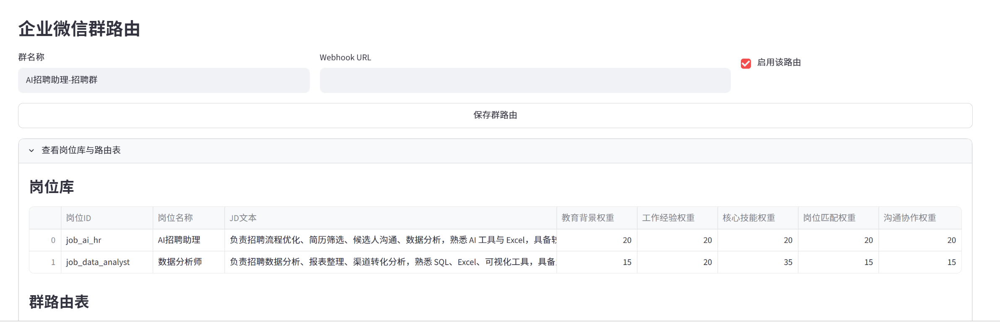
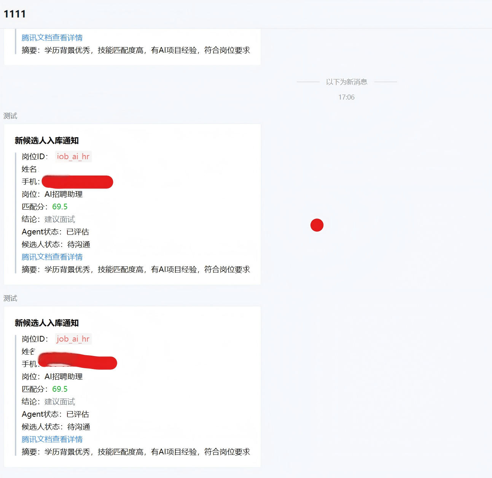
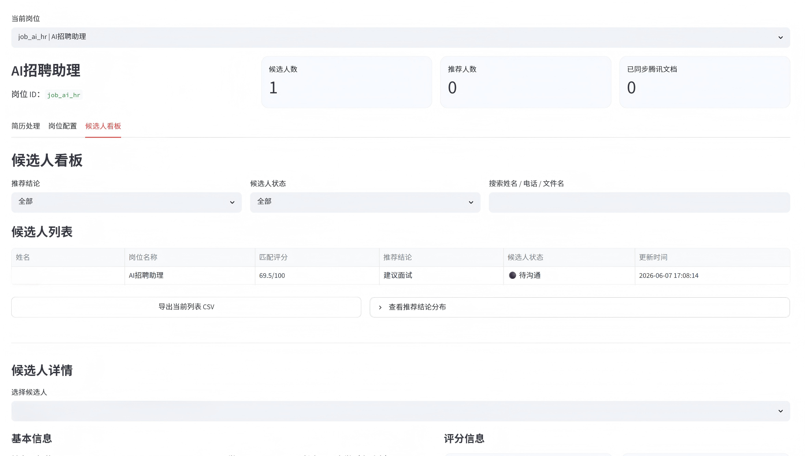
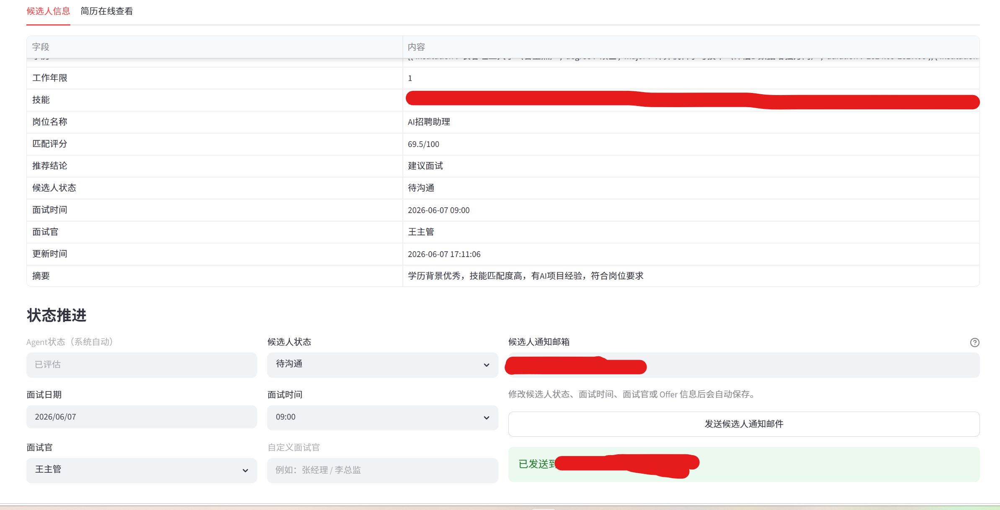
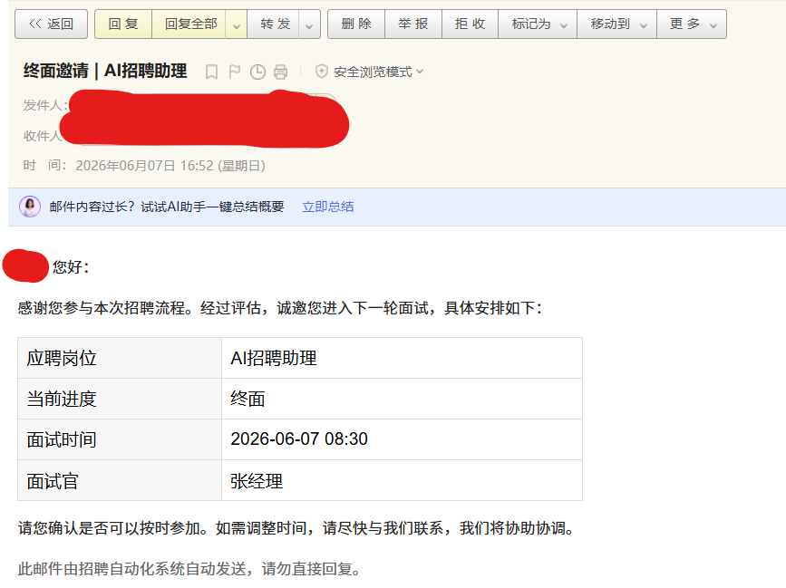

# 招聘自动化 MVP

一个基于 Streamlit 的招聘流程 Demo，覆盖简历导入、解析打分、岗位路由同步、候选人状态推进和候选人通知邮件。

## 当前能力

- 多来源导入：支持本地上传、邮箱附件拉取
- 简历处理：支持 PDF、DOCX、TXT 文本提取与自动重命名
- AI/规则解析：抽取姓名、电话、邮箱、学历、年限、技能、摘要
- JD 匹配打分：按岗位权重输出总分、维度分、推荐结论
- 路由同步：按岗位路由推送企业微信群，并写入腾讯文档
- 候选人看板：支持筛选、详情查看、简历预览、CSV 导出
- 状态推进：支持一面、二面、终面、淘汰、录用等状态维护
- 候选人通知邮件：支持面试邀请版、淘汰感谢版、Offer 通知版
- 数据清理：页面内支持清空已上传简历、清空候选人数据








## 目录结构

```text
.
├─ .env.example
├─ .gitignore
├─ app.py
├─ requirements.txt
└─ app
   ├─ config.py
   ├─ data
   │  ├─ candidates.csv
   │  ├─ positions.csv
   │  └─ wecom_routes.csv
   ├─ incoming
   ├─ processed
   ├─ models.py
   ├─ services
   └─ storage
```

目录说明：

- `app/incoming`: 待处理简历目录
- `app/processed`: 已处理简历归档目录
- `app/data/candidates.csv`: 候选人数据
- `app/data/positions.csv`: 岗位库
- `app/data/wecom_routes.csv`: 企业微信群路由表

## 快速启动

1. 创建并激活虚拟环境

```powershell
python -m venv .venv
.\.venv\Scripts\Activate.ps1
```

2. 安装依赖

```powershell
pip install -r requirements.txt
```

3. 复制环境变量模板

```powershell
Copy-Item .env.example .env
```

4. 按需填写 `.env`

至少建议配置：

- `LLM_API_KEY`
- `WECOM_WEBHOOK_URL` 或页面内岗位路由
- 腾讯文档相关配置
- 邮箱采集或 SMTP 配置

5. 启动应用

```powershell
streamlit run app.py
```

## 环境变量

### LLM

- `LLM_API_KEY`: 大模型 API Key
- `LLM_BASE_URL`: OpenAI 兼容接口地址，默认 `https://api.deepseek.com`
- `LLM_MODEL`: 模型名称，默认 `deepseek-chat`

说明：

- 未配置 LLM 时，系统仍可运行，会退回到规则解析和规则打分

### 企业微信群推送

- `WECOM_WEBHOOK_URL`: 企业微信群机器人 Webhook 兜底地址

说明：

- 系统支持多岗位多群自动路由
- 推荐优先在页面中维护 `position_id -> group_name -> webhook_url -> enabled`
- 当某个岗位没有单独配置路由时，才会使用 `WECOM_WEBHOOK_URL`

### 腾讯文档

- `TENCENT_DOCS_ACCESS_TOKEN`: 腾讯文档开放平台 Access Token
- `TENCENT_DOCS_CLIENT_ID`: 腾讯文档开放平台应用 ID
- `TENCENT_DOCS_OPEN_ID`: 当前授权用户 Open ID
- `TENCENT_DOCS_FILE_ID`: 腾讯文档文件 ID
- `TENCENT_DOCS_APPEND_ROWS_URL`: 可选，自定义写入接口地址
- `TENCENT_DOCS_FILE_URL`: 腾讯文档打开链接

说明：

- 默认使用官方 `batchUpdate` 接口
- 默认接口为 `https://docs.qq.com/openapi/spreadsheet/v3/files/{fileId}/batchUpdate`
- 工作表 `sheetId` 会从 `TENCENT_DOCS_FILE_URL` 的 `tab` 参数自动提取
- 如果你需要适配自己的请求体，可调整 [tencent_docs.py](./app/services/tencent_docs.py)
- 网络异常或权限异常会被安全降级，不会中断整批处理

### 邮箱采集

- `IMAP_ENABLED`: 是否启用邮箱采集，`true/false`
- `IMAP_HOST`: IMAP 服务器地址
- `IMAP_PORT`: IMAP 端口，默认 `993`
- `IMAP_USER`: 邮箱账号
- `IMAP_PASSWORD`: 邮箱密码或授权码
- `IMAP_FOLDER`: 邮箱文件夹，默认 `INBOX`

### 候选人通知邮件

- `SMTP_HOST`: SMTP 服务器地址
- `SMTP_PORT`: SMTP 端口
- `SMTP_USER`: 发件邮箱账号
- `SMTP_PASSWORD`: 发件邮箱密码或授权码
- `SMTP_FROM`: 发件人邮箱
- `SMTP_USE_TLS`: 是否启用 TLS，`true/false`
- `SMTP_USE_SSL`: 是否启用 SSL，`true/false`

当前邮件模板：

- 面试邀请版：适用于一面、二面、终面
- 淘汰感谢版：适用于已淘汰
- Offer 通知版：适用于已录用

常见邮箱示例：

- QQ 邮箱
  - `SMTP_HOST=smtp.qq.com`
  - `SMTP_PORT=587`
  - `SMTP_USE_TLS=true`
  - `SMTP_USE_SSL=false`
- 163 邮箱
  - `SMTP_HOST=smtp.163.com`
  - `SMTP_PORT=465`
  - `SMTP_USE_TLS=false`
  - `SMTP_USE_SSL=true`

## 页面功能

### 1. 岗位配置

- 维护岗位 ID、岗位名称、JD
- 配置教育背景、工作经验、核心技能、岗位匹配、沟通协作五个维度权重
- 系统会自动归一化，总分始终为 100

### 2. 企业微信群路由

- 按岗位配置不同群名称和 Webhook
- 支持启用/停用
- 支持查看岗位库和路由表

### 3. 简历处理

- 支持上传 PDF、DOCX、TXT 简历
- 上传后自动写入 `app/incoming`
- 支持按日期、发件人、主题、未读条件从邮箱导入附件
- 点击“批量处理并同步”后，系统会：
  - 提取文本
  - 解析候选人信息
  - 自动重命名简历
  - 计算 JD 匹配分与维度分
  - 写入 `candidates.csv`
  - 推送企业微信群
  - 同步腾讯文档
  - 将简历归档到 `app/processed`

### 4. 数据清理

- `清空已上传简历`：删除 `incoming` 和 `processed` 目录中的文件
- `清空候选人数据`：重置 `app/data/candidates.csv`

### 5. 候选人看板

- 按推荐结论、候选人状态、关键词筛选
- 查看候选人列表与推荐结论分布
- 导出当前筛选结果 CSV
- 查看候选人详情、评分维度、摘要和在线简历预览

### 6. 状态推进与通知

- 可维护候选人状态、面试时间、面试官、Offer 信息
- 修改状态、面试时间、面试官或 Offer 字段后会自动保存
- 看板详情会跟随最新保存值刷新
- 可直接向候选人发送通知邮件，默认使用候选人邮箱

## 典型流程

1. 在岗位配置里维护岗位和 JD
2. 在企业微信群路由里配置岗位对应群
3. 上传简历或从邮箱拉取附件
4. 点击“批量处理并同步”
5. 在候选人看板里筛选和查看详情
6. 推进候选人状态，填写面试安排或 Offer 信息
7. 发送候选人通知邮件

## 代码入口

- 主页面：[app.py](./app.py)
- 配置读取：[config.py](./app/config.py)
- 简历解析：[resume_parser.py](./app/services/resume_parser.py)
- JD 打分：[scoring.py](./app/services/scoring.py)
- 邮件采集：[collector.py](./app/services/collector.py)
- 候选人通知邮件：[mailer.py](./app/services/mailer.py)
- 企业微信通知：[notifier.py](./app/services/notifier.py)
- 腾讯文档同步：[tencent_docs.py](./app/services/tencent_docs.py)
- CSV 存储：[repository.py](./app/storage/repository.py)
